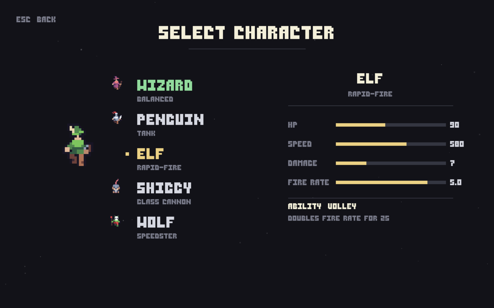

# The Way Out

A top-down pixel-art escape-room shooter. Pick a character, fight your
way through locked rooms, work the levers and pressure plates, and find
the way out.

<p align="center">
  
</p>

**Version:** v1.0.1 — see [Changelog](CHANGELOG.md)

The Way Out's main purpose is to test and develop [eeco](https://github.com/ajhahnde/eeco).

## Play

```bash
pip install pygame
python main.py
```

## Controls

| Input         | Action             |
| ------------- | ------------------ |
| WASD / Arrows | Move & aim (4-way) |
| Space         | Shoot              |
| Shift         | Dash               |
| E             | Use / interact     |
| Esc           | Pause / back       |

## Characters

Five playable characters, each with its own HP, speed, damage and
fire-rate profile: the balanced Wizard, the Penguin tank, the rapid-fire
Elf, the glass-cannon Shiggy, and the speedster Wolf.

## Levels

Three hand-authored escape rooms. Levels are plain text maps under
`assets/levels/` (see `LEGEND.md` for the tile vocabulary) plus a
`manifest.json`, so new rooms can be added without touching code. An
in-game editor (`editor.py`) edits them live.

## Project layout

| Path                                                          | Purpose                                  |
| ------------------------------------------------------------- | ---------------------------------------- |
| `main.py`                                                   | Entry point & game loop                  |
| `menu.py`                                                   | Title, settings, character & level menus |
| `levels.py`                                                 | Level loading & runtime                  |
| `units.py`                                                  | Player & enemy logic                     |
| `interactables.py` / `static_objects.py` / `tileset.py` | World objects                            |
| `editor.py`                                                 | In-game level editor                     |
| `theme.py`                                                  | Shared palette & UI helpers              |
| `audio.py`                                                  | Music & SFX                              |
| `assets/`                                                   | Sprites, audio, fonts, level maps        |

## Build (macOS)

```bash
./build_mac.sh        # arm64 .app
./build_mac_intel.sh  # x86_64 .app
```

The app self-updates from this repository on launch via `updater.py`;
save data lives outside the app bundle and is never touched by updates.

## Versioning

Semantic versioning (`vMAJOR.MINOR.PATCH`); each release is a single
annotated git tag. See [`CHANGELOG.md`](CHANGELOG.md) for the history.
